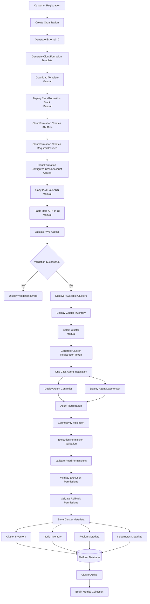
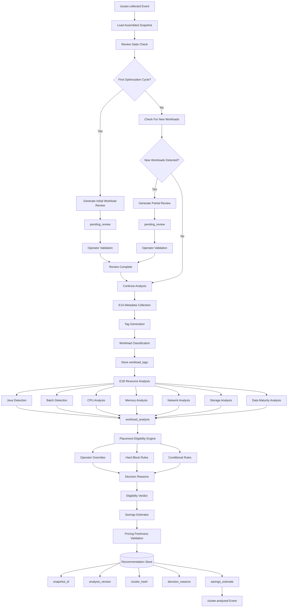
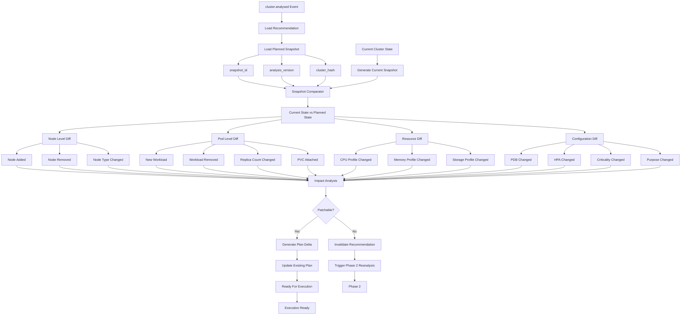
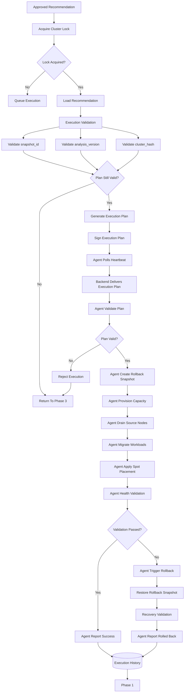
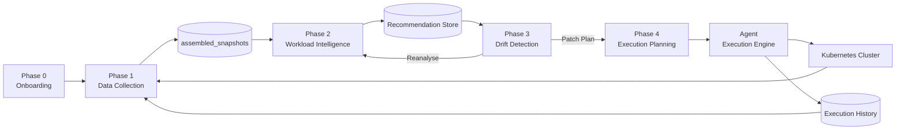

# PHASE 0 — ONBOARDING FLOW

---

# PHASE 1 — DATA COLLECTION PIPELINE

```mermaid
flowchart TD

subgraph Cluster_Specific_Data

A[BalanceKube Agent]

A --> B[Cluster Inventory Collection]

B --> C[Nodes]
B --> D[Pods]
B --> E[Deployments]
B --> F[StatefulSets]
B --> G[DaemonSets]
B --> H[PVCs]
B --> I[PDBs]
B --> J[Namespaces]
B --> K[Labels]
B --> L[Annotations]
B --> M[Affinity Rules]
B --> N[Taints & Tolerations]

A --> O[Metrics Collection]

O --> P[Kubelet Summary API]
O --> Q[Metrics Server]

P --> R[CPU Usage]
P --> S[Memory Usage]
P --> T[Network Usage]
P --> U[Filesystem Usage]

Q --> R
Q --> S
Q --> T
Q --> U

A --> V[Cluster Event Collection]

V --> W[Spot Termination Notices]
V --> X[Node Conditions]
V --> Y[Pod Conditions]
V --> Z[Kubernetes Events]

end

subgraph Global_Platform_Data

AA[Pricing Collection Worker]

AA --> AB[AWS Pricing API]

AB --> AC[On Demand Prices]
AB --> AD[Spot Prices]
AB --> AE[Instance Catalog]

AF[Spot Risk Collection Worker]

AF --> AG[AWS Spot Advisor]

AG --> AH[Interruption Rates]

AH --> AI[Historical Spot Risk Dataset]

AJ[Metadata Collection Worker]

AJ --> AK[Region Metadata]

AJ --> AL[Availability Zone Metadata]

AJ --> AM[Instance Metadata]

end

C --> AN[Snapshot Assembly]
D --> AN
E --> AN
F --> AN
G --> AN
H --> AN
I --> AN
J --> AN
K --> AN
L --> AN
M --> AN
N --> AN

R --> AN
S --> AN
T --> AN
U --> AN

W --> AN
X --> AN
Y --> AN
Z --> AN

AC --> AN
AD --> AN
AE --> AN

AI --> AN

AK --> AN
AL --> AN
AM --> AN

AN --> AO[assembled_snapshots]

AO --> AP[cluster.collected Event]

AP --> AQ[Phase 2]
```

---

# PHASE 2 — WORKLOAD INTELLIGENCE ENGINE

---

# PHASE 3 — DRIFT DETECTION ENGINE

---

# PHASE 4 — EXECUTION ENGINE

---

# COMPLETE END-TO-END BALANCEKUBE FLOW

